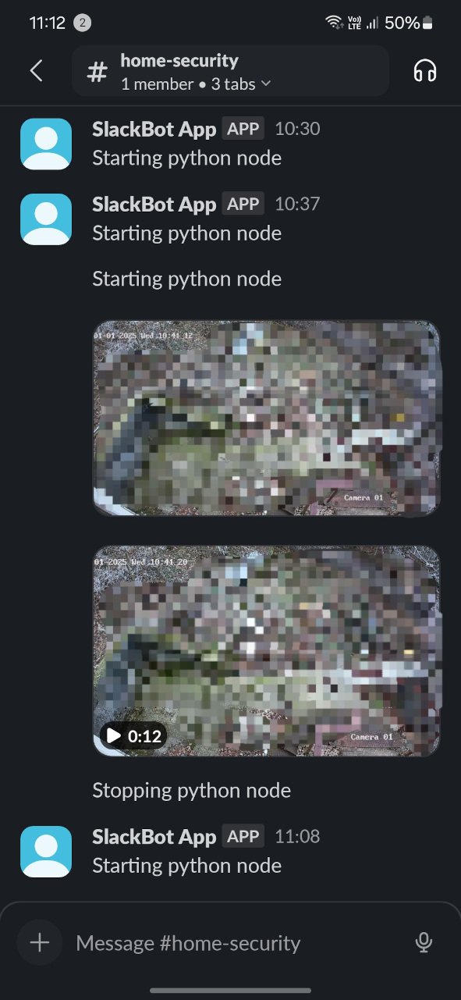

# ONVIF-Bot

ONVIF-Bot is a tool that integrates IP cameras with Telegram and Slack bots, enabling real-time video transmission on RTSP motion event triggers. Perfect for security and automation projects, this bot simplifies the process of receiving alerts and videos directly from your IP cameras.

## Tested Devices

ONVIF-Bot has been tested and verified with the following IP cameras:

- Hikvision IPC-B140H
- TP-Link Tapo C320WS
- TP-Link Tapo C200

## Features

- Motion Detection: Responds to ONVIF-compatible motion events from IP cameras.
- RTSP Stream Integration: Captures video feeds and prepares clips for transmission.
- Multi-platform Support: Sends notifications and videos through Telegram or Slack bots.

## Use Cases

- Home security monitoring.
- Real-time alerts for surveillance.
- Smart image and video notifications via messaging apps—no subscriptions required.

## How to Create a Telegram or Slack Bot

Creating a bot for Telegram or Slack is simple and well-documented. Follow the official guides below:

- **Telegram Bot**: Visit the [Telegram Bot API Documentation](https://core.telegram.org/bots#botfather) to learn how to create and manage your bot using BotFather.

  > **Available chat commands:**
  >
  > `/grabimage`: Captures an image from the RTSP stream and sends it to the Telegram channel.  
  > `/grabvideo`: Captures a video from the RTSP stream and sends it to the Telegram channel.

- **Slack Bot**: Check out the [Slack API Documentation](https://api.slack.com/start/building) for a step-by-step guide on setting up a Slack bot and integrating it into your workspace.

  > **Required Slack OAuth Permissions:**
  >
  > `chat:write`: Allows the bot to send messages in channels or DMs.  
  > `files:write`: Enables the bot to upload and share files.

## Configuration Example

Below is an example configuration structure for ONVIF-Bot (`user_data.yaml`):

```yaml
cameras:
  # You can add multiple cameras
  Hikvision_IPCB140h_telegram:  # Camera name
    username: "camera_username"
    password: "camera_password"
    camera_ip: "camera_ip_address"
    camera_onvif_port: camera_onvif_port
    nomedia: False  # If true, only alert will be sent, no video
    bot: "telegram"  # Bot name must match with one of the bots in "bots" below
  TPLink_C320WS_slack:  # Camera name
    username: "camera_username"
    password: "camera_password"
    camera_ip: "camera_ip_address"
    camera_onvif_port: camera_onvif_port
    nomedia: False  # If true, only alert will be sent, no video
    bot: "slack"  # Bot name must match with one of the bots in "bots" below

bots:
  telegram:
    token: "telegram_bot_token"
    channel_id: "telegram_channel_id"
  #slack:
  #  token: "xoxb-********"  # Bot User OAuth Token
  #  channel_id: "channel_id"
```

## Screenshots

|                              Telegram                              |                            Slack                             |
| :----------------------------------------------------------------: | :----------------------------------------------------------: |
|  |  |

## Contributing

Contributions to ONVIF-Bot are welcome and appreciated! Here's how you can help:

1. Fork the repository and clone it locally.
2. Create a new branch for your contribution:
   ```sh
   git checkout -b feature/your-feature-name
   ```
